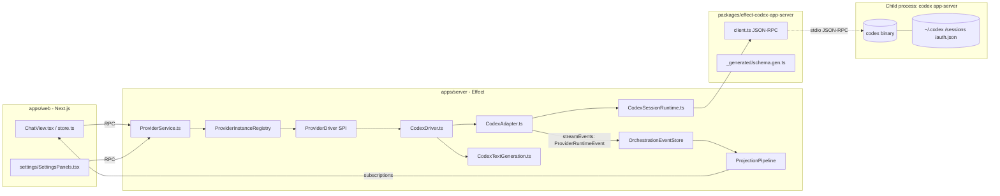

# Phase 1 Investigation: Replacing Codex with pi-mono in t3code

Repos read (snapshot in `/tmp/pi-investigation/`):
- `t3code` — pingdotgg/t3code upstream, branch `main`.
- `pi-mono` — `@mariozechner/pi-coding-agent` v0.73.0 and friends.
- `pi-gui` — `minghinmatthewlam/pi-gui`, used as reference only.

---

## 1. Current Codex integration in t3code

### 1.1 Architecture in one paragraph

t3code is a Bun monorepo with `apps/server` (Effect-based backend), `apps/web` (Next.js / React renderer), `apps/desktop` (Tauri shell that loads `apps/web`), and a set of `packages/` for contracts, shared utilities, and a typed wrapper around the Codex app-server JSON-RPC protocol (`packages/effect-codex-app-server`). Codex is one of four "providers" — the others are Claude (also via a CLI app-server), Cursor, and OpenCode — and is already abstracted behind a `ProviderDriver` SPI. Each provider instance owns its own Codex child process, scoped to an Effect `Scope` that is closed when the instance is torn down.

### 1.2 How Codex is invoked

It is a **child process** spawned per session, **not** an SDK call and not a shared local server. Exact spawn site:

- `apps/server/src/provider/Layers/CodexSessionRuntime.ts:699-716` — `spawner.spawn(ChildProcess.make(options.binaryPath, ["app-server"], { cwd, env, shell: process.platform === "win32" }))`. `binaryPath` and `homePath` come from typed `CodexSettings`; `homePath` is forwarded into the spawned env as `CODEX_HOME` after `expandHomePath` (`CodexSessionRuntime.ts:691-698`).

The child speaks Codex's "app-server" JSON-RPC dialect over stdio. Wrapper: `packages/effect-codex-app-server/src/client.ts:1-60`, with generated method schemas in `packages/effect-codex-app-server/src/_generated/meta.gen.ts` and hand-maintained protocol code in `.../src/protocol.ts`.

In addition to per-session app-server processes, the same binary is invoked **non-interactively** for utility text generation (commit messages, PR titles, branch names) via `apps/server/src/textGeneration/CodexTextGeneration.ts` (CODEX_HOME plumbing at `:188`). That uses `codex exec`, not `codex app-server`.

### 1.3 Message / event protocol between renderer and Codex

Two layers of types:

1. **Codex-native** raw schema generated from upstream Codex: `packages/effect-codex-app-server/src/_generated/schema.gen.ts` — types like `V2ItemStartedNotification`, `ServerRequest__ApplyPatchApprovalParams`, `ToolRequestUserInputParams`.
2. **Canonical / driver-neutral** runtime events: `packages/contracts/src/providerRuntime.ts:147-195` defines a `ProviderRuntimeEventType` literal union of 50+ event types (`session.started`, `thread.token-usage.updated`, `turn.started`, `turn.completed`, `item.started`, `item.completed`, `content.delta`, `request.opened`, `request.resolved`, `user-input.requested`, `runtime.error`, `runtime.warning`, `model.rerouted`, `mcp.oauth.completed`, `account.rate-limits.updated`, …).

The Codex adapter translates layer 1 → layer 2 in `apps/server/src/provider/Layers/CodexAdapter.ts`. The translation table is `mapToRuntimeEvents` (`CodexAdapter.ts:475-1322`); every Codex notification method is hand-mapped to one or more `ProviderRuntimeEvent`s.

Concrete shapes:
- `ProviderRuntimeEventBase` (`providerRuntime.ts:246-260`): `{ eventId, provider, providerInstanceId?, threadId, createdAt, turnId?, itemId?, requestId?, providerRefs?, raw? }`.
- `content.delta.streamKind` literal: `"assistant_text" | "reasoning_text" | "reasoning_summary_text" | "plan_text" | "command_output" | "file_change_output"` (see `CodexAdapter.ts:367-389`).

The **adapter contract** the rest of the server consumes is `apps/server/src/provider/Services/ProviderAdapter.ts:45-126`:

```
ProviderAdapterShape<TError> {
  provider, capabilities,
  startSession, sendTurn, interruptTurn,
  respondToRequest,           // approval decisions
  respondToUserInput,         // structured tool questions
  stopSession, listSessions, hasSession,
  readThread, rollbackThread,
  stopAll,
  streamEvents: Stream<ProviderRuntimeEvent>
}
```

Approval flow:
- Codex sends `item/commandExecution/requestApproval`, `item/fileChange/requestApproval`, `applyPatchApproval`, `execCommandApproval`, or `item/tool/requestUserInput` (`CodexAdapter.ts:496-568`).
- Adapter emits canonical `request.opened` with `requestType: "command_execution_approval" | "file_read_approval" | "file_change_approval" | "apply_patch_approval" | "exec_command_approval" | "tool_user_input"` (mapping `CodexAdapter.ts:273-307`).
- Renderer responds via `respondToRequest` (`ProviderApprovalDecision`) or `respondToUserInput` (`ProviderUserInputAnswers`). Pending approval/user-input refs are tracked in `CodexSessionRuntime.ts:185-208`.

File-edit diffs:
- `turn.diff.updated` (`CodexAdapter.ts:799-813`) carries a `unifiedDiff: string` sourced from Codex's `V2TurnDiffUpdatedNotification.diff`.
- Per-file changes flow through `item.started` / `item.completed` with `itemType: "file_change"` (`CodexAdapter.ts:212-214`).

Cancellation: `interruptTurn(threadId, turnId?)` → `CodexSessionRuntimeShape.interruptTurn` (`CodexSessionRuntime.ts:118`).

Session resume: `ProviderSessionStartInput.resumeCursor` decoded against `CodexResumeCursorSchema = Schema.Struct({ threadId: Schema.String })` (`CodexSessionRuntime.ts:53-55`). Adapter calls `thread/start` if absent, else `thread/resume`, with graceful fallback to `thread/start` on recoverable resume errors (`CodexSessionRuntime.ts:414-451`).

### 1.4 Codex auth & config storage

- Auth: `~/.codex/auth.json`, owned by Codex itself. t3code reads it only for telemetry (`apps/server/src/telemetry/Identify.ts:35`), and surfaces auth status by calling Codex (`account/chatgptAuthTokens/refresh` mapped at `CodexAdapter.ts:289-290`).
- Multi-account "shadow home" (per-instance `auth.json`, shared everything else via symlinks) at `apps/server/src/provider/Drivers/CodexHomeLayout.ts:1-100`, docs at `docs/providers/codex.md`.
- t3code-side settings typed in `packages/contracts/src/settings.ts:141-186`: `CodexSettings = { enabled, binaryPath, homePath, shadowHomePath, ... }`, patches at `:392-410`, providers map at `:344`.

### 1.5 Sessions persistence

t3code does **not** persist Codex thread payloads. Codex owns sessions on disk under `$CODEX_HOME/sessions/` and `$CODEX_HOME/sqlite/` (`CodexHomeLayout.ts:16-26`). t3code persists its own event-sourced projection (`apps/server/src/persistence/Layers/OrchestrationEventStore.ts`, `ProjectionRepositories.ts`) keyed by t3code's own `ThreadId`, with the Codex provider thread id captured as a `resumeCursor`. Optional NDJSON event capture: `apps/server/src/provider/Layers/EventNdjsonLogger.ts` (used from `CodexAdapter.ts:56`).

### 1.6 Producer ↔ consumer seam

- Backend production: `streamEvents` getter on the `CodexAdapter` closure (`CodexAdapter.ts:1677-1679`).
- Server bus: `provider/Services/ProviderService.ts` → `orchestration/Layers/ProviderRuntimeIngestion.ts` → `orchestration/Layers/ProjectionPipeline.ts` → `orchestration/Layers/CheckpointReactor.ts`.
- Renderer consumption: tRPC-ish RPC under `apps/web/src/rpc/` and `apps/web/src/environments/runtime/`; rendering in `apps/web/src/components/ChatView.tsx`, `ChatView.logic.ts`, `session-logic.ts`, `store.ts`. Codex-aware presentation in `apps/web/src/providerSkillPresentation.ts` and `apps/web/src/components/settings/providerDriverMeta.ts`.

### 1.7 Architecture diagram



### 1.8 Exhaustive list of Codex-touching files

(Generated via `grep -li codex` over `apps/`, `packages/`, `scripts/`. ~117 files total, 69 server + 48 web.)

**Server — provider plumbing (active):**
- `apps/server/src/provider/Drivers/CodexDriver.ts`
- `apps/server/src/provider/Drivers/CodexHomeLayout.ts` + test
- `apps/server/src/provider/Layers/CodexAdapter.ts` + test
- `apps/server/src/provider/Layers/CodexProvider.ts`
- `apps/server/src/provider/Layers/CodexSessionRuntime.ts` + test
- `apps/server/src/provider/Services/CodexAdapter.ts`
- `apps/server/src/provider/CodexDeveloperInstructions.ts`
- `apps/server/src/provider/builtInDrivers.ts:23,46`
- `apps/server/src/provider/Layers/ProviderRegistry.ts` + test
- `apps/server/src/provider/Layers/ProviderAdapterRegistry.ts` + test
- `apps/server/src/provider/Layers/ProviderEventLoggers.ts`
- `apps/server/src/provider/Layers/ProviderInstanceRegistryHydration.ts`
- `apps/server/src/provider/Layers/ProviderInstanceRegistryLive.test.ts`
- `apps/server/src/provider/Layers/ProviderService.test.ts`
- `apps/server/src/provider/Layers/scopedSafeTeardown.ts`
- `apps/server/src/provider/Services/ProviderAdapterRegistry.ts`
- `apps/server/src/provider/Services/ProviderService.ts`
- `apps/server/src/provider/providerStatusCache.ts` + test
- `apps/server/src/provider/testUtils/providerAdapterRegistryMock.ts`

**Server — non-interactive utility:**
- `apps/server/src/textGeneration/CodexTextGeneration.ts` + test
- `apps/server/src/textGeneration/TextGeneration.ts`, `TextGenerationPrompts.ts`, `TextGenerationUtils.ts`

**Server — orchestration / persistence:**
- `apps/server/src/orchestration/Layers/CheckpointReactor.ts`
- `apps/server/src/orchestration/Layers/ProviderRuntimeIngestion.test.ts`
- `apps/server/src/orchestration/Layers/ProviderCommandReactor.test.ts`
- `apps/server/src/orchestration/Layers/ProjectionSnapshotQuery.test.ts`
- `apps/server/src/orchestration/Layers/OrchestrationEngine.test.ts`
- `apps/server/src/orchestration/Layers/ProjectionPipeline.test.ts`
- `apps/server/src/orchestration/projector.test.ts`
- `apps/server/src/orchestration/decider.delete.test.ts`
- `apps/server/src/orchestration/decider.projectScripts.test.ts`
- `apps/server/src/orchestration/commandInvariants.test.ts`
- `apps/server/src/persistence/Layers/OrchestrationEventStore.test.ts`
- `apps/server/src/persistence/Layers/ProjectionRepositories.test.ts`
- `apps/server/src/persistence/Migrations/016_CanonicalizeModelSelections.ts` + tests for 016/024/025/026
- `apps/server/src/observability/Metrics.test.ts`
- `apps/server/src/serverRuntimeStartup.ts` + test
- `apps/server/src/serverSettings.test.ts`, `server.test.ts`
- `apps/server/src/pathExpansion.ts` + test
- `apps/server/src/telemetry/Identify.ts:35`

**Server — integration tests / scripts:**
- `apps/server/integration/{fixtures/providerRuntime.ts, OrchestrationEngineHarness.integration.ts, TestProviderAdapter.integration.ts, orchestrationEngine.integration.test.ts, providerService.integration.test.ts}`
- `apps/server/scripts/acp-mock-agent.ts`

**Web — renderer:**
- `apps/web/src/components/ChatView.tsx`, `ChatView.logic.ts(.test.ts/.browser.tsx)`
- `apps/web/src/components/Sidebar.logic.test.ts`, `CommandPalette.tsx(.logic.test.ts)`, `KeybindingsToast.browser.tsx`
- `apps/web/src/components/chat/{ChatComposer.tsx, ChangedFilesTree.test.tsx, composerProviderState.test.tsx, modelPickerSearch.ts(.test), ModelListRow.tsx, ModelPickerContent.tsx, ModelPickerSidebar.tsx, ProviderModelPicker.browser.tsx, ProviderInstanceIcon.tsx, providerIconUtils.ts, TraitsPicker.tsx}`
- `apps/web/src/components/settings/{SettingsPanels.tsx(.logic.ts/.logic.test.ts), ProviderModelsSection.tsx, ProviderSettingsForm.test.ts, ProviderInstanceCard.tsx, AddProviderInstanceDialog.tsx, providerDriverMeta.ts}`
- `apps/web/src/{composerDraftStore.ts(.test), environmentGrouping.test.ts, environments/runtime/service.threadSubscriptions.test.ts, localApi.test.ts, modelOrdering.test.ts, modelSelection.ts(.test), orchestrationEventEffects.test.ts, lib/threadSort.test.ts, proposedPlan.test.ts, providerInstances.ts(.test), providerModels.ts, providerSkillPresentation.ts(.test), rpc/serverState.test.ts, session-logic.ts(.test), store.ts(.test), types.ts, worktreeCleanup.test.ts}`

**Packages:**
- `packages/contracts/src/{settings.ts(.test), server.test.ts, orchestration.test.ts, provider.test.ts, providerInstance.ts(.test), providerRuntime.ts(.test), model.ts}`
- `packages/effect-codex-app-server/**` — entire package
- `packages/shared/src/model.ts(.test), serverSettings.test.ts`

**Docs / scripts / misc:**
- `docs/providers/codex.md`, `docs/providers/claude.md`, `docs/effect-fn-checklist.md`
- `scripts/release-smoke.ts`
- `README.md`, `AGENTS.md`, `.docs/{architecture.md, codex-prerequisites.md, encyclopedia.md, provider-architecture.md, workspace-layout.md}`
- `.plans/{01,03,11,12,13,16,16c,17,17,19,branch-environment-picker,README}.md`
- `.github/ISSUE_TEMPLATE/bug_report.yml`

---

## 2. pi-mono surface to integrate against

### 2.1 Package map (`pi-mono/packages/`)

- **`ai/` — `@mariozechner/pi-ai`.** Multi-provider LLM SDK (Anthropic, OpenAI, Google, Bedrock, Mistral). Exposes `streamSimple`, `Model`, `ThinkingBudgets`, OAuth helpers (`./oauth`). Entry: `packages/ai/src/index.ts`. Subpath exports include `./openai-codex-responses` — *probably* an OpenAI-Responses-API client for codex-class models, **not** the same protocol as the `codex` CLI's app-server (manifest line 33-36).
- **`agent/` — `@mariozechner/pi-agent-core`.** Generic agent runtime: tool calling, streaming, abort, before/after-tool hooks, message queues for steering / follow-up. Entry: `packages/agent/src/index.ts`. Public types: `packages/agent/src/types.ts:374-390` (`AgentEvent`). Class: `packages/agent/src/agent.ts:93-120` (`Agent`, `AgentOptions`).
- **`coding-agent/` — `@mariozechner/pi-coding-agent`.** The CLI app **and** the programmatic SDK. `bin: { pi: dist/cli.js }`, `main: dist/index.js`. Public surface: `packages/coding-agent/src/index.ts:1-354` re-exports `AgentSession`, `AgentSessionRuntime`, `createAgentSession`, `createAgentSessionRuntime`, `AuthStorage`, `ModelRegistry`, tool factories, `runRpcMode`, `RpcClient`, etc.
- **`tui/`, `web-ui/`** — irrelevant for t3code (its renderer is React).

### 2.2 `pi-coding-agent`: programmatic API or CLI?

**Both, and the programmatic API is the one to integrate against.**

- CLI headless mode: `runRpcMode(runtimeHost: AgentSessionRuntime)` at `packages/coding-agent/src/modes/rpc/rpc-mode.ts:48`. Protocol is JSONL stdin/stdout, exhaustively typed in `packages/coding-agent/src/modes/rpc/rpc-types.ts:19-264`. Commands include `prompt`, `steer`, `follow_up`, `abort`, `new_session`, `set_model`, `set_thinking_level`, `compact`, `bash`, `switch_session`, `fork`, `clone`, `get_messages`, `get_session_stats`, `export_html`. Out of band: `extension_ui_request` / `extension_ui_response` for confirms / inputs / selects.
- Programmatic seam: `createAgentSession` / `createAgentSessionRuntime` in `packages/coding-agent/src/core/sdk.ts:1-120` (re-exported from `index.ts:163-190`). `pi-gui` consumes pi this way — see `pi-gui/packages/pi-sdk-driver/src/session-supervisor.ts:6-15` (imports `AgentSessionRuntime`, `AgentSession`, `AgentSessionEvent`, `CreateAgentSessionOptions` from `@mariozechner/pi-coding-agent`) and `:155-156` where it just calls `createAgentSessionRuntime(createOptions)`.

Stability: `pi-gui` is a working production reference doing exactly the swap we are contemplating. Programmatic API preserves type info that JSONL erases (e.g. `Model<any>`) and avoids a stdin/stdout round trip inside a server that already runs Effect.

### 2.3 `pi-agent-core` — the tool/event seam

- `AgentEvent` (`packages/agent/src/types.ts:374-390`):

  ```
  AgentEvent =
    | { type: "agent_start" }
    | { type: "agent_end"; messages }
    | { type: "turn_start" }
    | { type: "turn_end"; message; toolResults }
    | { type: "message_start"; message }
    | { type: "message_update"; message; assistantMessageEvent }
    | { type: "message_end"; message }
    | { type: "tool_execution_start"; toolCallId; toolName; args }
    | { type: "tool_execution_update"; toolCallId; toolName; args; partialResult }
    | { type: "tool_execution_end"; toolCallId; toolName; result; isError }
  ```

  No event distinguishes assistant text from reasoning at this layer — both come through `message_update.assistantMessageEvent` (a `pi-ai` payload). Mapping to t3code's `content.delta { streamKind: ... }` requires unwrapping `AssistantMessageEvent` from `pi-ai`.

- `AgentTool<TParameters, TDetails>` (`types.ts:332-355`): `execute`, `prepareArguments`, `executionMode` ("sequential" | "parallel"), `label`. `AgentToolCall` at `types.ts:39`.

- Approval-ish hooks: `beforeToolCall(context, signal) -> { block?, reason? }` and `afterToolCall(context, signal) -> Partial overrides + terminate?` (`types.ts:228-247`). The hook is async and dispatch waits for it — perfect for implementing approval gating, but the user-prompt round trip has to live inside whatever wraps the hook.

### 2.4 `pi-ai` — auth & provider model

- pi-ai uses provider API keys (env vars) **or** OAuth tokens issued per provider. Storage: `AuthStorage` (`coding-agent/src/core/auth-storage.ts:1-80`) at `~/.pi/agent/auth.json`. Each entry is `{ type: "api_key", key }` or `{ type: "oauth", ...OAuthCredentials }`.
- **No "Codex" / ChatGPT provider.** pi-mono ships `openai-codex-responses` but that is an OpenAI Responses API client, not the `codex` CLI's app-server protocol. Needs user confirmation; not run by me.
- t3code expects auth to live with the upstream agent (Codex owns `auth.json`). pi inverts that: pi owns `~/.pi/agent/auth.json` and the host app must mediate model selection / OAuth flows through `AuthStorage` and `ModelRegistry` (the pattern `pi-gui` follows in `pi-sdk-driver/src/runtime-deps.ts`).

### 2.5 Sessions

- pi persists sessions as **JSONL** files: each line is a `FileEntry = SessionHeader | SessionEntry` (`coding-agent/src/core/session-manager.ts:28-150`), appended via `appendFileSync` (`session-manager.ts:813-817`, `_appendEntry` / `_persist`). Default location: `getSessionsDir()` under agent dir.
- Entry types (`session-manager.ts:51-150`): `message`, `thinking_level_change`, `model_change`, `compaction`, `branch_summary`, `custom`, `custom_message`, `label`, `session_info`. Versioned `CURRENT_SESSION_VERSION = 3` (`:28`).
- Completely different format from Codex's `$CODEX_HOME/sessions/`. They do not conflict (different directories). t3code's `resumeCursor: { threadId }` won't be meaningful for pi — pi resumes by reopening the JSONL file by id.

### 2.6 Tools shipped with pi-coding-agent

`packages/coding-agent/src/core/tools/`: `read.ts`, `write.ts`, `edit.ts` + `edit-diff.ts` + `file-mutation-queue.ts`, `bash.ts`, `find.ts`, `grep.ts`, `ls.ts`. Helpers: `output-accumulator.ts`, `path-utils.ts`, `render-utils.ts`, `tool-definition-wrapper.ts`, `truncate.ts`.

Factories exported from `coding-agent/src/index.ts:233-281`: `createCodingTools`, `createReadOnlyTools`, plus per-tool factories and `withFileMutationQueue`.

Mapping to t3code's approval UI:
- All pi tools flow through `AgentTool.execute` and the `beforeToolCall`/`afterToolCall` hooks. **No native concept of an approval request event.**
- Codex's distinct approval kinds collapse, in pi, to "host decides whether tool X is allowed". Host can re-derive `requestType` from tool name (`bash` → command, `edit`/`write` → file_change). But Codex's `tool_user_input` (structured questions) has no pi-side analog.

### 2.7 t3code expects X | pi-mono provides Y | gap is Z

| t3code expects | pi-mono provides | Gap / mapping notes |
|---|---|---|
| `ProviderAdapterShape.startSession(input)` | `createAgentSessionRuntime({ cwd, model, ... })` | No native `runtimeMode`; host must translate to `beforeToolCall` policy. |
| `sendTurn({ input, attachments, modelSelection, interactionMode })` | `AgentSession.prompt(message, images?)` (RPC: `{ type: "prompt", message, images? }`) | `interactionMode = "plan"` has no equivalent — system-prompt only. |
| `interruptTurn(threadId, turnId?)` | `AgentSession.abort()` / RPC `abort` | Per-turn granularity is lost. |
| `respondToRequest(threadId, requestId, decision)` | `beforeToolCall` blocking | Host keeps pending-approval map keyed by tool call id. |
| `respondToUserInput(threadId, requestId, answers)` | `extension_ui_response` | Pi's flow is for **extensions**, not tools. No native analog for `tool_user_input`. |
| `readThread`, `rollbackThread(N)` | `SessionManager.getMessages()`, `fork(entryId)` | Pi forks at entry id, not turn count. Renderer needs a translation. |
| `streamEvents: Stream<ProviderRuntimeEvent>` | `AgentSession.subscribe(listener)` (`agent-session.ts:121-143, 713`) | Many-to-many mapping. Codex-only events (`mcp.oauth.completed`, `account.rate-limits.updated`, `windowsSandbox/*`, `thread.realtime.*`, `model.rerouted`) simply never fire. |
| `CodexResumeCursorSchema = { threadId }` | Pi session id = string | Schema fits at type level; conceptually different store. |
| Multi-account via `CODEX_HOME` shadow overlay | Multiple `agentDir` values | 1:1 reproducible. |
| Codex-native approval payloads (`reason`, `command`) | Tool args from `AgentToolCall` | Renderer that reads `payload.command` will need to inspect args by tool name. |
| `attachments: { type: "image", url: "data:..." }` | `ImageContent[]` / `SessionAttachment` | Small adapter. |
| `reasoningEffort`, `fastMode` | `ThinkingLevel` per-model + `ThinkingBudgets` | Translation table required. |
| `textGeneration` via `codex exec` | `streamSimple` from pi-ai directly | Easier — bypass agent loop entirely. |

---

## 3. Identify the seam

### 3.1 The seam already exists

`ProviderDriver` (`apps/server/src/provider/ProviderDriver.ts:117-155`) is an explicit driver SPI built precisely so new agent backends can be added without touching renderer or orchestration code:

```
ProviderDriver<Config, R> {
  driverKind, metadata, configSchema, defaultConfig,
  create(input) -> Effect<ProviderInstance, ProviderDriverError, R | Scope>
}
```

`BUILT_IN_DRIVERS` (`apps/server/src/provider/builtInDrivers.ts:45-50`) already lists four. Adding a fifth — `PiDriver` — is the documented extension point (`builtInDrivers.ts:11-15`). `ProviderInstance.adapter` is `ProviderAdapterShape` (`ProviderDriver.ts:62-72`); the renderer/orchestration stack consumes `ProviderRuntimeEvent` via `adapter.streamEvents` and never sees Codex types. Codex-native types are confined to `apps/server/src/provider/Layers/CodexAdapter.ts` and `packages/effect-codex-app-server/`.

### 3.2 Recommendation: option (a) — driver/adapter

**Build a `PiDriver` alongside `CodexDriver`, gated by configuration.**

Reasons:
1. **The seam is already in t3code.** pi-mono is a normal npm library; it does not need an extra adapter. The work is implementing `ProviderAdapterShape` against pi's `AgentSessionRuntime`, parallel to `CodexDriver.ts` + `CodexAdapter.ts`.
2. **Stacked-PR friendliness is real here.** Decomposes cleanly:
   1. `PiSettings` schema + no-op `PiDriver` (registers, reports unavailable).
   2. `PiAdapter.startSession` + `streamEvents` with AgentEvent → ProviderRuntimeEvent mapping (largest single PR).
   3. `sendTurn` / `interruptTurn`.
   4. Approval gating (`respondToRequest` via `beforeToolCall`-managed Deferred map).
   5. `readThread` / `rollbackThread` / fork.
   6. `PiTextGeneration` (replaces `codex exec`).
   7. Settings UI / model picker / default-driver flip.
3. **Reversibility.** Until step 7, Codex stays default; pi changes are observable in isolation.
4. **Reference exists.** `pi-gui/packages/pi-sdk-driver/src/session-supervisor.ts` gives concrete patterns (`ManagedSessionRecord`, host-UI request bridging, runtime supervisor) to apply.

When option (b) is genuinely better: only if you want to delete Codex code in the same change set. Even then, build pi behind the SPI first and remove Codex driver/adapter/runtime/contracts in a final PR — that strictly dominates "replace in one shot".

I do not see a case for jumping to (b). The driver SPI is already there, already battle-tested with three siblings, and the work fits its shape.

---

## 4. Risk register

### 4.1 Event-shape mismatches forcing renderer changes

- **`request.opened.payload.requestType` / `detail` / `args`** built from Codex-specific payloads (`CodexAdapter.ts:496-568`). Renderer code in `apps/web/src/components/chat/ChangedFilesTree.test.tsx`, `apps/web/src/components/ChatView.logic.ts`, `apps/web/src/providerSkillPresentation.ts` works as long as the pi adapter emits `requestType ∈ CanonicalRequestType` and a reasonable `detail` string. Specific risk: code reading `event.payload.args.command` or `.path` will break unless the pi approval bridge synthesizes shaped args.
- **`content.delta.streamKind`** — mapping `message_update.assistantMessageEvent` → five-value `streamKind` is the main translation tax. Renderers that switch on `streamKind` (`ChatView.tsx` and friends) are touchpoints.
- **`turn.proposed.delta` / `turn.proposed.completed`** — Codex emits these for plan-mode (`CodexAdapter.ts:822-877`). Pi has no equivalent; either emulate via system-prompted turn or hide plan UI when driver=pi.
- **`thread.realtime.*`, `mcp.oauth.completed`, `account.rate-limits.updated`, `windowsSandbox/setupCompleted`, `deprecation.notice`, `windows/worldWritableWarning`, `model.rerouted`** — Codex-only. Pi driver won't emit them; renderer already treats payloads as optional.
- **`turn.diff.updated.unifiedDiff`** — pi emits per-file edits; driver must accumulate them into a unified diff or renderer needs a new shape.

### 4.2 Auth flows

- Codex login is out of band (user runs `codex login`). pi auth is **t3code-mediated**: `AuthStorage` is in-process. OAuth flows (e.g. Anthropic via pi-ai's `./oauth`) must fire from t3code UI; pi-gui has reference patterns in `runtime-deps.ts` / `runtime-supervisor.ts`.
- "Shadow home" is Codex-shaped. pi equivalent = multiple `agentDir` values. Settings UI needs a new pi-shaped schema, not a port of `CodexSettings`.
- `apps/server/src/telemetry/Identify.ts:35` reads `~/.codex/auth.json` for analytics id. Dead code if pi is the only driver; still works alongside.

### 4.3 Approval / permission UX differences

- Codex emits an explicit, typed approval request event with a Codex-supplied `requestId`; t3code resolves it via `respondToRequest`.
- Pi has no native approval-request event. Adapter must **manufacture** it: when `beforeToolCall` fires for a `bash` tool with `runtimeMode = "approval-required"`, generate a synthetic `request.opened`, park the hook on a Deferred, resolve it on `respondToRequest`.
- Request ids are now adapter-generated. Existing event-store records with Codex ids still resolve via Codex; new pi sessions get pi-shaped ids. No migration needed (per-session).
- `tool_user_input` has no pi-native analog. Hide when driver=pi or implement as a pi extension.

### 4.4 t3code UI assumptions that won't translate

- **Plan mode** (`CodexDeveloperInstructions.ts`, `interactionMode: "plan" | "default"`, `CodexSessionRuntime.ts:303-323`) uses Codex-specific `collaborationMode`. Pi needs system-prompt only.
- **`fastMode` and `reasoningEffort`** model-selection options (`CodexAdapter.ts:1499-1517`) are Codex-specific. Pi has `ThinkingLevel` / `ThinkingBudgets`; needs a translation table.
- **`continuationIdentity`** (`ProviderDriver.ts:74-87`) — Codex uses `codex:home:<sharedHomePath>`. pi equivalent: `pi:agentDir:<agentDir>`.
- Cosmetic hard-coding in `apps/web/src/components/settings/providerDriverMeta.ts`, `apps/web/src/components/chat/providerIconUtils.ts` is trivial to extend.

### 4.5 Licensing

Verified by reading `LICENSE` directly:
- `t3code/LICENSE` — MIT, "Copyright (c) 2026 T3 Tools Inc."
- `pi-mono/LICENSE` — MIT, "Copyright (c) 2025 Mario Zechner".
- `pi-gui/LICENSE` — MIT, "Copyright (c) 2026 Matthew Lam".

All MIT. No obstruction. Preserve attributions if any pi code is vendored.

### 4.6 Other hazards

- **Effect vs. Promise boundary.** t3code is heavily Effect-based; pi is plain async. Bridge with `Effect.async` / `Stream.async` and hold pi resources in `Effect.acquireRelease`. Same pattern as `CodexAdapter.ts:1653-1659`.
- **`tsgo` build dependency in pi-mono.** Not standard. Consuming published npm packages avoids this; vendored / local-link does not.
- **`@silvia-odwyer/photon-node` WASM** is a `pi-coding-agent` runtime dep (`coding-agent/package.json:45`). `photon_rs_bg.wasm` must be reachable at runtime if pi is in-process inside `apps/server`.
- **Default model UX.** `pi-coding-agent` ships no API keys; on a fresh install, `findInitialModel` returns nothing if `~/.pi/agent/auth.json` is empty. First-time UX differs from Codex. Product UX, not blocker.
- **In-process vs. spawned pi.** t3code is a single Bun server. In-process matches pi-gui's design. RPC mode (`pi --rpc`) is the fallback if you want crash isolation or remote pi. User decision.

---

## 5. Open questions for the user

1. **Programmatic vs. RPC consumption of pi.** Default: embed pi as a library (`createAgentSessionRuntime`). Confirm — or push for `pi --rpc` if process isolation matters.
2. **Coexistence vs. replacement.** Ship pi alongside Codex (like Claude / OpenCode coexist today), or retire Codex once pi is solid? Affects whether to plan a final "delete Codex" PR.
3. **Auth model.** Which providers and which auth modes for the first pi driver? (Anthropic OAuth only? API keys only? Full grid?)
4. **Plan mode.** Must "plan mode" keep working with pi? If yes, system-prompt-only emulation; if no, hide the toggle when driver=pi.
5. **`tool_user_input`.** Surfaced in any feature your users actively use? If no, skip for v1; if yes, design a pi-extension shape.
6. **`rollbackThread(N)` semantics.** UI affordances on N-turn rollback that we should preserve, or can the renderer use entry ids?
7. **`PiSettings` shape.** Mirror `CodexSettings` (one `agentDir` per instance) or accept single-instance pi for v1?
8. **Text-generation.** OK to drop the `codex exec` shape and call `streamSimple` from pi-ai directly with a small system prompt?
9. **Telemetry.** Need a pi-only equivalent of `Identify.ts`'s analytics id, or remove entirely?
10. **MCP / sandbox UI.** Do panels in `SettingsPanels.tsx` or elsewhere actively rely on `mcp.oauth.completed` / `account.rate-limits.updated` / `windowsSandbox/*`? A quick eyeball would answer this.

---

## Appendix: confidence calibration

I did **not** verify by running:
- That `pi --rpc` works against the version `t3code` would integrate. Types and code paths exist and look complete; not executed.
- Whether `pi-ai`'s `openai-codex-responses` provider is or is not the same protocol as the `codex` CLI's app-server. Naming suggests **not**. Confirming requires reading `pi-mono/packages/ai/src/providers/openai-codex-responses.ts` (not done).
- Whether `apps/web/` reads Codex-native shapes via `event.raw.payload`. The canonical contract permits a `raw` escape hatch (`providerRuntime.ts:259`); spot-checks didn't find any uses, but I did not exhaustively grep.
